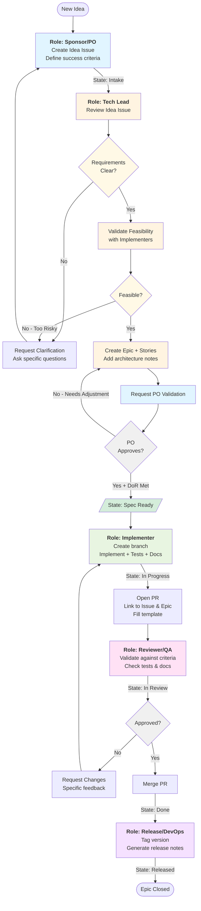

# GitHub Copilot SDLC Workflow System

**A Role-Based Software Development Lifecycle Framework for GitHub**

---

## Table of Contents

- [Overview](#-overview)
- [Using as Submodule](#using-as-submodule)
- [What This Is](#what-this-is)
- [Workflow Flowchart](#workflow-flowchart)
- [Directory Structure](#directory-structure)
- [Quick Start](#quick-start)
- [Role-Based Prompts](#role-based-prompts-for-testing)
- [Multi-Role Testing](#-multi-role-testing-setup)
- [Quick Navigation](#quick-navigation)
- [Extending the System](#extending-the-system)
- [File Purposes](#file-purposes)
- [Naming Conventions](#naming-conventions)

---

## 📋 Overview

### Purpose

Provide a **structured, AI-assisted software development workflow** that transforms idea-to-release cycles into a traceable, role-based process. Designed for teams (or individuals wearing multiple hats) who want to leverage GitHub Copilot and GitHub's native features to maintain discipline without heavy tooling overhead.

### Goal

Enable **consistent, high-quality software delivery** by:
- Defining clear responsibilities across 5 key roles (PO, Tech Lead, Implementer, QA, Release)
- Enforcing quality gates through Definition of Ready and Definition of Done
- Maintaining complete traceability from idea → story → PR → release
- Providing AI assistant context for "touchless" or low-touch development

### Methodology

**Git Flow inspired, trunk-based flexible approach:**
- **Issue-driven development:** Every change starts with a GitHub issue
- **Template-guided creation:** Standardized templates ensure completeness
- **Role-based review gates:** Each stage has specific validation criteria
- **Branch strategy:** Feature branches → develop → release → main with proper versioning
- **AI-augmented workflow:** Copilot Chat prompts guide each role's responsibilities

### Expected Outcomes

✅ **Reduced ambiguity** - Clear success criteria for every feature  
✅ **Faster onboarding** - New team members follow templates and role guides  
✅ **Better quality** - Automated checks, required tests, and review checklists  
✅ **Complete traceability** - Know why every line of code exists  
✅ **Consistent releases** - Standardized versioning and changelog generation  
✅ **AI efficiency** - Copilot can generate entire features following your standards  

### Integration Method

**Submodule-based distribution** - Add this workflow to any project as a Git submodule in the `.github` directory. GitHub automatically recognizes issue templates and workflows. Track specific branches (main, develop, release) or pin to exact versions for stability.

---

<div align="center">

[](https://github.com/nsin08/github-copilot-sdlc/releases)
[](https://github.com/nsin08/github-copilot-sdlc)
[](LICENSE)

[Quick Start](#quick-start) • [Documentation](#directory-structure) • [Role Guides](#quick-navigation) • [Examples](#role-based-prompts-for-testing)

</div>

---

## Using as Submodule

**Add this workflow system to your project:**

```bash
# Navigate to your project root
cd your-project/

# Add as submodule directly to .github directory
git submodule add https://github.com/nsin08/github-copilot-sdlc.git .github
git submodule update --init --recursive

# Commit
git add .github .gitmodules
git commit -m "Add SDLC workflow template system"
git push
```

**Update submodule to latest version:**

```bash
cd your-project/
git submodule update --remote --merge .github

# Review changes, then commit
git add .github
git commit -m "Update SDLC workflow template system"
git push
```

**Track specific branch (e.g., develop, release, or feature):**

```bash
# Track develop branch for latest features
git config -f .gitmodules submodule..github.branch develop
git submodule update --remote --merge .github
git add .gitmodules .github
git commit -m "Track develop branch for workflow templates"

# Track a release branch for stability
git config -f .gitmodules submodule..github.branch release/v1.2.0
git submodule update --remote --merge .github

# Track a specific feature branch (temporary)
git config -f .gitmodules submodule..github.branch feature/new-templates
git submodule update --remote --merge .github

# Switch back to main (default)
git config -f .gitmodules submodule..github.branch main
git submodule update --remote --merge .github
```

**Pin to specific version (commit hash):**

```bash
# Enter submodule and checkout specific commit
cd .github
git checkout abc1234  # specific commit hash
cd ..

# Commit the pinned version
git add .github
git commit -m "Pin workflow templates to version abc1234"
git push

# To update later, repeat with new commit hash
```

**Common submodule operations:**

```bash
# Check current submodule status
git submodule status

# Initialize after cloning project with submodules
git submodule update --init --recursive

# Pull latest from tracked branch
git submodule update --remote --merge .github

# Reset submodule to committed state
git submodule update --force .github

# Remove submodule
git submodule deinit .github
git rm .github
rm -rf .git/modules/.github
```

**Benefits of using as submodule:**
- ✅ Stay up-to-date with workflow improvements
- ✅ Consistent workflow across multiple projects
- ✅ Track specific branches (main, develop, release)
- ✅ Pin to specific versions for stability
- ✅ Easy to customize locally while tracking upstream changes
- ✅ Revert to previous versions if needed

---

## What This Is

A **standalone, reusable `.github` directory** implementing a role-based software development lifecycle.

**Currently Implemented (5 Roles):**
1. **Sponsor/PO** → Creates Ideas with success criteria
2. **Tech Lead** → Breaks down into Epic + Stories
3. **Implementer** → Builds features, opens PRs
4. **Reviewer/QA** → Validates against criteria
5. **Release/DevOps** → Tags, releases, closes Epics

---

## Workflow Flowchart

<div align="center">



</div>

**Key Workflow States:**
- 🟦 **Intake** → Idea exists, needs breakdown
- 🟨 **Spec Ready** → Epic & Stories defined, ready to implement
- 🟩 **In Progress** → Active development
- 🟪 **In Review** → PR open, awaiting validation
- ✅ **Done** → PR merged
- 🎉 **Released** → Version tagged, Epic closed

---

## Directory Structure

```
.github/
├── README.md                     # This file
├── copilot-instructions.md       # AI assistant context
│
├── ISSUE_TEMPLATE/               # Templates (GitHub required location)
│   ├── 00-pull-request-template.md  # (Copy to .github/PULL_REQUEST_TEMPLATE.md for auto-fill)
│   ├── 01-epic.md
│   ├── 02-story-task.md
│   └── 03-review-checklist.md
│
├── workflows/                    # CI/CD
│   └── test.yml
│
└── workflow-system/              # Modular documentation (extensible)
    ├── README.md                 # System overview
    ├── rules/                    # Workflow rules (7 files)
    ├── roles/                    # Role definitions (7 files)
    ├── guides/                   # User guides (5 files)
    └── examples/                 # Real examples (5 files)
```

---

## Quick Start

### 1. Add to Your Project

**Option A: Via Submodule (Recommended)**

```bash
# Add as submodule directly to .github
git submodule add https://github.com/nsin08/github-copilot-sdlc.git .github
git submodule update --init --recursive
```

**Option B: Direct Copy (Fork & Modify)**

```bash
# Copy directory
cp -r path/to/downloaded/.github your-project/
```

### 2. Customize

1. Edit `copilot-instructions.md` for your tech stack
2. Edit `workflows/test.yml` for your language
3. **Optional:** For PR template auto-fill, copy `ISSUE_TEMPLATE/00-pull-request-template.md` to `.github/PULL_REQUEST_TEMPLATE.md` (GitHub requires this specific location/name for auto-fill)

### 3. Test

```bash
# Create test issue
gh issue create
# Should show 3 templates (Epic, Story, Review)

# Create test PR
gh pr create
# Manually copy PR template content OR enable auto-fill (see step 2.3 above)
```

---

## Role-Based Prompts for Testing

Use these prompts in separate VS Code Copilot Chat threads to simulate different roles:

### 🎯 Sponsor/PO Role

**Setup Prompt:**
```
I'm acting as a Product Owner / Sponsor. Load context from @workspace .github/workflow-system/roles/01-sponsor-po.md

I need to create ideas with clear success criteria, validate Epic breakdowns, and approve specifications before implementation.
```

**Action Examples:**
- "Create an Idea issue for a personal calendar application"
- "Review Epic #1 and validate if it meets user needs"
- "Approve Story #3 - does it have clear success criteria?"

---

### 🏗️ Tech Lead Role

**Setup Prompt:**
```
I'm acting as a Technical Lead. Load context from @workspace .github/workflow-system/roles/02-tech-lead.md

I need to break down Ideas into Epics and Stories, define technical architecture, and ensure Definition of Ready is met.
```

**Action Examples:**
- "Break down Idea #2 into an Epic with Stories"
- "Create Story issues for Epic #1"
- "Review Story #5 for technical feasibility"
- "Define architecture approach for the calendar data model"

---

### 💻 Implementer Role

**Setup Prompt:**
```
I'm acting as an Implementer. Load context from @workspace .github/workflow-system/roles/03-implementer.md

I need to implement Stories, write tests, create PRs, and ensure Definition of Done is met.
```

**Action Examples:**
- "Implement Story #7 - calendar event data model"
- "Create a PR for Story #8 with all evidence"
- "Write tests for the event persistence feature"
- "Review PR checklist before submitting"

---

### ✅ Reviewer/QA Role

**Setup Prompt:**
```
I'm acting as a Reviewer / QA. Load context from @workspace .github/workflow-system/roles/04-reviewer-qa.md

I need to review PRs against success criteria, validate tests, and ensure quality standards are met.
```

**Action Examples:**
- "Review PR #12 against Story #8 success criteria"
- "Check if PR #15 meets Definition of Done"
- "Validate test coverage for the calendar UI"
- "Request changes for PR #10"

---

### 🚀 Release/DevOps Role

**Setup Prompt:**
```
I'm acting as Release Manager / DevOps. Load context from @workspace .github/workflow-system/roles/05-release-devops.md

I need to tag releases, generate release notes, close Epics, and manage deployment.
```

**Action Examples:**
- "Create release v0.1.0 with all merged PRs"
- "Generate release notes for Epic #1"
- "Close Epic #1 after release"
- "Tag and deploy the calendar application"

---

### 🧪 Multi-Role Testing Setup

**Using 2 VS Code Windows:**

**Window 1 - Planning Roles (PO + Tech Lead):**
```
Thread 1: PO - Create Ideas and validate Epics
Thread 2: Tech Lead - Break down into Stories
```

**Window 2 - Execution Roles (Implementer + QA):**
```
Thread 1: Implementer - Build features and create PRs
Thread 2: QA - Review PRs and validate quality
```

**Example Workflow:**
1. **PO (Window 1, Thread 1):** "Create Idea issue for personal calendar"
2. **Tech Lead (Window 1, Thread 2):** "Break down Idea #1 into Epic + Stories"
3. **PO (Window 1, Thread 1):** "Review and approve Epic #2"
4. **Implementer (Window 2, Thread 1):** "Implement Story #3"
5. **QA (Window 2, Thread 2):** "Review PR #5 for Story #3"
6. **Release (either window):** "Create release v0.1.0"

---

### 📋 Detailed Multi-Role Testing: Personal Calendar Example

**Scenario:** Build a personal calendar application using the SDLC workflow with role separation.

---

#### **Phase 1: Ideation (PO Role)**

**VS Code Window 1 - Chat Thread 1**

**Setup:**
```
I'm acting as a Product Owner / Sponsor. Load context from @workspace .github/workflow-system/roles/01-sponsor-po.md

I need to create ideas with clear success criteria, validate Epic breakdowns, and approve specifications.
```

**Action 1 - Create Idea Issue:**
```
Create an Idea issue for a personal calendar application using the Epic template.

Requirements:
- User can view calendar by month
- User can add/edit/delete events
- Events persist across sessions
- Clean, minimal UI
- Works in modern browsers

Use the issue template at .github/ISSUE_TEMPLATE/01-epic.md
```

**Expected Output:** Draft issue content with success criteria

**Action 2 - Open Issue on GitHub:**
```bash
# Copy the generated content and create the issue
gh issue create --title "Personal Calendar Application" --body "<paste content>"
# Note the issue number (e.g., #1)
```

---

#### **Phase 2: Technical Planning (Tech Lead Role)**

**VS Code Window 1 - Chat Thread 2**

**Setup:**
```
I'm acting as a Technical Lead. Load context from @workspace .github/workflow-system/roles/02-tech-lead.md

I need to break down Idea #1 (Personal Calendar) into Epics and Stories with technical architecture.

Review the Idea issue and create:
1. Epic issue with architecture notes
2. Story issues with clear acceptance criteria
```

**Action 1 - Review Idea:**
```
Review Idea issue #1 for technical feasibility. Consider:
- Frontend tech stack (vanilla JS vs framework)
- Data storage (localStorage vs backend)
- Calendar library needs
- Browser compatibility

What questions do I need to ask the PO?
```

**Action 2 - Create Epic + Stories:**
```
Break down Idea #1 into:
- 1 Epic issue
- 4-5 Story issues covering:
  * Data model (Event structure)
  * Calendar UI (month view)
  * Event management (add/edit/delete)
  * Data persistence
  * Basic styling

Use template at .github/ISSUE_TEMPLATE/01-epic.md for Epic
Use template at .github/ISSUE_TEMPLATE/02-story-task.md for Stories

Include:
- Parent references
- Success criteria
- Estimated complexity
- Technical notes
```

**Expected Output:** 
- Epic issue content (e.g., "Epic: Personal Calendar MVP")
- 5 Story issue contents

**Action 3 - Create Issues:**
```bash
# Create Epic
gh issue create --title "Epic: Personal Calendar MVP" --body "<paste epic content>"
# Note: #2

# Create Stories
gh issue create --title "Story: Event data model and storage" --body "<paste story>" --label "story"
# Note: #3

gh issue create --title "Story: Month view calendar UI" --body "<paste story>" --label "story"
# Note: #4

gh issue create --title "Story: Add/edit event form" --body "<paste story>" --label "story"
# Note: #5

gh issue create --title "Story: Event persistence (localStorage)" --body "<paste story>" --label "story"
# Note: #6

gh issue create --title "Story: Basic calendar styling" --body "<paste story>" --label "story"
# Note: #7
```

---

#### **Phase 3: Validation (PO Role)**

**VS Code Window 1 - Chat Thread 1** (switch back to PO)

**Action 1 - Review Epic:**
```
Review Epic issue #2. Does it:
- Address all user needs from Idea #1?
- Have clear scope?
- Include all necessary Stories?

Provide approval or request changes.
```

**Action 2 - Approve (or Request Changes):**
```bash
# If approved
gh issue comment 2 --body "✅ Approved - meets requirements. Moving to Spec Ready."
gh issue edit 2 --add-label "spec-ready"

# If changes needed
gh issue comment 2 --body "❌ Requested changes: [specific feedback]"
```

---

#### **Phase 4: Implementation (Implementer Role)**

**VS Code Window 2 - Chat Thread 1**

**Setup:**
```
I'm acting as an Implementer. Load context from @workspace .github/workflow-system/roles/03-implementer.md

I need to implement Story #3 (Event data model) following Definition of Done.

Project: Personal Calendar
Tech Stack: Vanilla JavaScript, HTML, CSS
```

**Action 1 - Create Feature Branch:**
```bash
git checkout develop
git pull
git checkout -b feature/3-event-data-model
```

**Action 2 - Implement Story:**
```
Implement Story #3 - Event data model and storage.

Create:
1. src/models/Event.js - Event class with properties (id, title, date, time, description)
2. src/services/EventStorage.js - localStorage wrapper
3. tests/Event.test.js - Unit tests
4. Basic HTML harness to test

Requirements from Story #3:
[paste success criteria from issue]

Follow Definition of Done from .github/workflow-system/rules/03-definition-of-done.md
```

**Expected Output:** Complete implementation with files

**Action 3 - Create Files:**
```bash
# Copilot generates the code, you create files
mkdir -p src/models src/services tests
# Create files with generated content
```

**Action 4 - Test:**
```bash
# Run tests (or open HTML test harness)
npm test  # or open test.html in browser
```

**Action 5 - Commit and Push:**
```bash
git add .
git commit -m "feat: implement event data model and storage (#3)"
git push -u origin feature/3-event-data-model
```

**Action 6 - Create PR:**
```
Create a PR for Story #3 using the template at .github/ISSUE_TEMPLATE/00-pull-request-template.md

Include:
- Summary of changes
- Files changed
- Evidence of success criteria being met
- Test results
- Screenshots (if applicable)

Base: develop
Closes: #3
Epic: #2
```

```bash
gh pr create --base develop --title "feat(model): Event data model and storage (#3)" --body "<paste PR content>"
# Note PR number (e.g., #8)
```

---

#### **Phase 5: Review (QA Role)**

**VS Code Window 2 - Chat Thread 2**

**Setup:**
```
I'm acting as a Reviewer / QA. Load context from @workspace .github/workflow-system/roles/04-reviewer-qa.md

I need to review PR #8 against Story #3 success criteria and Definition of Done.
```

**Action 1 - Review Code:**
```bash
# Checkout PR
gh pr checkout 8

# Review files
code src/models/Event.js
code src/services/EventStorage.js
code tests/Event.test.js
```

**Action 2 - Validate Against Criteria:**
```
Review PR #8 for Story #3.

Check:
1. Does it meet all success criteria from Story #3?
2. Are tests present and passing?
3. Is code documented?
4. Follows Definition of Done?
5. No security issues?

Review using template at .github/ISSUE_TEMPLATE/03-review-checklist.md
```

**Action 3 - Provide Feedback:**
```bash
# If approved
gh pr review 8 --approve --body "✅ LGTM - meets all criteria. Tests pass, code is clean."

# If changes needed
gh pr review 8 --request-changes --body "❌ Requested changes:
- [ ] Add validation for date format
- [ ] Missing test for edge case: empty title"
```

**Action 4 - Merge (if approved):**
```bash
gh pr merge 8 --squash --delete-branch
# PR #8 merged, Story #3 closed automatically
```

---

#### **Phase 6: Continue Development**

**Repeat Phase 4-5 for remaining Stories:**
- Story #4 (Month view UI) → PR #9
- Story #5 (Add/edit form) → PR #10
- Story #6 (Persistence) → PR #11
- Story #7 (Styling) → PR #12

**Track Progress:**
```bash
# Check Epic progress
gh issue view 2
# Should show child issues being closed
```

---

#### **Phase 7: Release (Release/DevOps Role)**

**Either VS Code Window - New Thread**

**Setup:**
```
I'm acting as Release Manager / DevOps. Load context from @workspace .github/workflow-system/roles/05-release-devops.md

All Stories for Epic #2 are complete. Ready to create release v0.1.0.
```

**Action 1 - Verify Completion:**
```bash
# Check all PRs merged
gh pr list --base develop --state merged

# Check Epic
gh issue view 2
```

**Action 2 - Create Release Branch:**
```bash
git checkout develop
git pull
git checkout -b release/v0.1.0
```

**Action 3 - Prepare Release:**
```
Generate release notes for v0.1.0 including:
- All closed Stories (#3, #4, #5, #6, #7)
- All merged PRs (#8, #9, #10, #11, #12)
- Epic closure (#2)

Format as changelog.
```

**Action 4 - Merge to Main:**
```bash
# Merge release to main
git checkout main
git pull
git merge release/v0.1.0
git tag v0.1.0 -m "Release v0.1.0 - Personal Calendar MVP"
git push origin main --tags

# Backport to develop
git checkout develop
git merge release/v0.1.0
git push

# Delete release branch
git branch -d release/v0.1.0
git push origin --delete release/v0.1.0
```

**Action 5 - Create GitHub Release:**
```bash
gh release create v0.1.0 --title "v0.1.0 - Personal Calendar MVP" --notes "<paste release notes>"
```

**Action 6 - Close Epic:**
```bash
gh issue close 2 --comment "✅ Released in v0.1.0. All Stories complete."
```

---

### 📊 Progress Tracking

**Throughout the workflow, track:**

```bash
# View all issues
gh issue list

# View Epic with children
gh issue view 2

# View PRs
gh pr list

# Check CI status
gh pr checks <pr-number>

# View release history
gh release list
```

---

### 🎯 Key Takeaways for Multi-Role Testing

1. **Separation of Concerns:** Each role has specific context and responsibilities
2. **Clear Handoffs:** PO → Tech Lead → Implementer → QA → Release
3. **Traceability:** Issues → Branches → PRs → Releases all linked
4. **Validation Gates:** Each phase has approval/validation before proceeding
5. **Role Context:** Use separate chat threads with role-specific prompts
6. **GitHub Integration:** All work tracked in issues/PRs, not just local files

---

## Quick Navigation

| Need | Location |
|------|----------|
| **Rules** | |
| State machine (workflow states) | [workflow-system/rules/01-state-machine.md](workflow-system/rules/01-state-machine.md) |
| Definition of Ready | [workflow-system/rules/02-definition-of-ready.md](workflow-system/rules/02-definition-of-ready.md) |
| Definition of Done | [workflow-system/rules/03-definition-of-done.md](workflow-system/rules/03-definition-of-done.md) |
| Artifact linking | [workflow-system/rules/04-artifact-linking.md](workflow-system/rules/04-artifact-linking.md) |
| PR hygiene | [workflow-system/rules/05-pr-hygiene.md](workflow-system/rules/05-pr-hygiene.md) |
| Versioning | [workflow-system/rules/06-versioning.md](workflow-system/rules/06-versioning.md) |
| Branching strategy | [workflow-system/rules/07-branching-strategy.md](workflow-system/rules/07-branching-strategy.md) |
| **Roles** | |
| All roles overview | [workflow-system/roles/00-index.md](workflow-system/roles/00-index.md) |
| PO prompt | [workflow-system/roles/01-sponsor-po.md](workflow-system/roles/01-sponsor-po.md) |
| Tech Lead prompt | [workflow-system/roles/02-tech-lead.md](workflow-system/roles/02-tech-lead.md) |
| Implementer prompt | [workflow-system/roles/03-implementer.md](workflow-system/roles/03-implementer.md) |
| QA prompt | [workflow-system/roles/04-reviewer-qa.md](workflow-system/roles/04-reviewer-qa.md) |
| Release prompt | [workflow-system/roles/05-release-devops.md](workflow-system/roles/05-release-devops.md) |
| **Guides** | |
| Integration guide | [workflow-system/guides/01-integration.md](workflow-system/guides/01-integration.md) |
| 30-min quick start | [workflow-system/guides/02-quick-start.md](workflow-system/guides/02-quick-start.md) |
| Customization | [workflow-system/guides/03-customization.md](workflow-system/guides/03-customization.md) |
| Enforcement & automation | [workflow-system/guides/04-enforcement-automation.md](workflow-system/guides/04-enforcement-automation.md) |
| **Examples** | |
| Epic breakdown | [workflow-system/examples/01-epic-breakdown.md](workflow-system/examples/01-epic-breakdown.md) |
| PR with evidence | [workflow-system/examples/02-pr-with-evidence.md](workflow-system/examples/02-pr-with-evidence.md) |
| QA review | [workflow-system/examples/03-qa-review.md](workflow-system/examples/03-qa-review.md) |
| Release notes | [workflow-system/examples/04-release-notes.md](workflow-system/examples/04-release-notes.md) |

---

## Extending the System

### Add a New Rule
1. Create `workflow-system/rules/07-your-rule.md`
2. Follow template in [workflow-system/rules/00-index.md](workflow-system/rules/00-index.md)

### Add a New Role
1. Create `workflow-system/roles/06-your-role.md`
2. Follow template in [workflow-system/roles/00-index.md](workflow-system/roles/00-index.md)

### Add a New Example
1. Create `workflow-system/examples/05-your-example.md`
2. Update index

---

## File Purposes

| File | Purpose | Required By |
|------|---------|-------------|
| `copilot-instructions.md` | AI context for Copilot | GitHub Copilot |
| `ISSUE_TEMPLATE/*.md` | Issue/PR templates | GitHub |
| `workflows/*.yml` | CI/CD automation | GitHub Actions |
| `workflow-system/` | Documentation (modular) | Humans & AI |

---

## Naming Conventions

| Pattern | Example | Usage |
|---------|---------|-------|
| `NN-name.md` | `01-state-machine.md` | Numbered files (ordered) |
| `00-index.md` | `rules/00-index.md` | Directory index |
| `00-shared-*.md` | `00-shared-context.md` | Shared/base content |
| `kebab-case` | `02-quick-start.md` | Multi-word with numbers |

---

**Full documentation:** [workflow-system/README.md](workflow-system/README.md)
